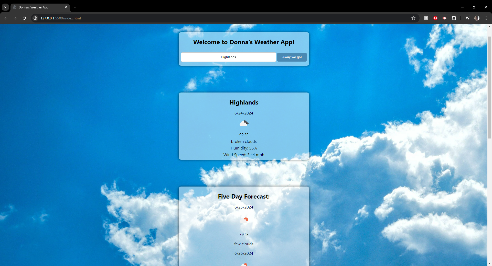

# Donna's Weather App

## Overview

**Donna's Weather App** is a web application that provides current weather information, a five-day weather forecast, and a history of previously searched cities. The app uses the OpenWeatherMap API to fetch weather data based on user input.

## Features

-Current Weather Information: Displays the current weather, temperature, humidity, wind speed, and a weather icon for the entered city. 
-Five-Day Forecast: Provides a five-day weather forecast with temperature, weather description, and icons. 
-Search History: Keeps a record of previously searched cities, allowing users to quickly fetch weather data for those cities again.

## Technologies Used

-HTML5 
-CSS3 
-JavaScript (ES6) 
-OpenWeatherMap API 
-LocalStorage for saving search history

## Usage

1. Enter a City: Type the name of a city into the input field.
2. Search Weather: Click the "Away we go!" button to fetch and display the current weather and forecast for the entered city.
3. View Forecast: Scroll down to see the five-day weather forecast.
4. Check History: Previously searched cities are listed at the bottom. Click on a city name to fetch its weather data again.

## License

This app is licensed with the Unlicense. Please refer to the Unlicense documentation for more information.

## Contributions

Contributions are welcome! If you have suggestions for improvements or want to report bugs, please open an issue or submit a pull request.

## Contact

For questions, please contact Donna Burns: [Github](https://github.com/donnacancode)
